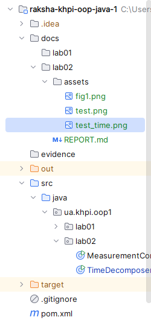
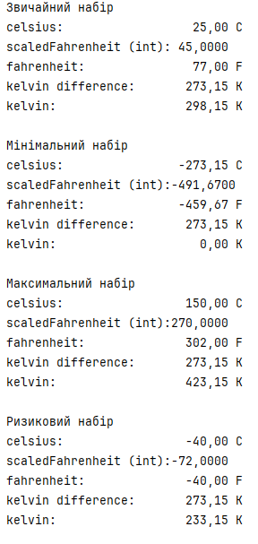
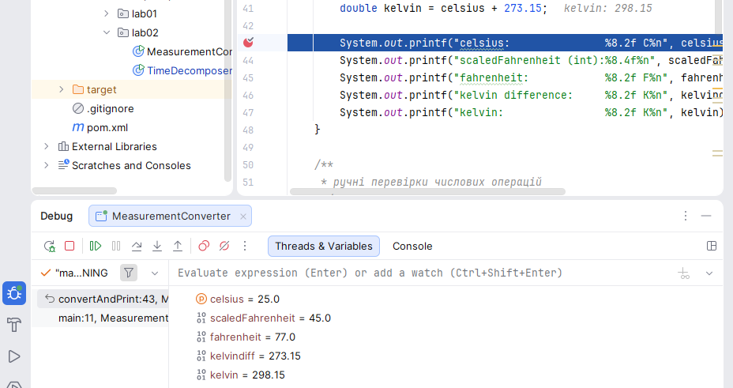
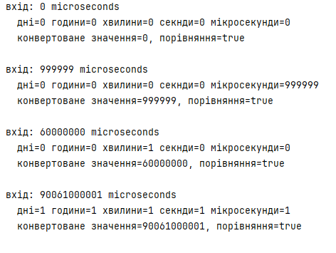

# Звіт з лабораторної роботи № 2

- **Тема:** Типи даних, літерали та перетворення
- **Виконав:** Ракша Вадим КН-925А
- **Варіант:** 1 (Температурний канал)
- **Репозиторій:**(https://github.com/Nevalik/raksha-khpi-oop-java-1)
- **Гілка:** `lab02`
- **Pull Request:** https://github.com/Nevalik/raksha-khpi-oop-java-1/pull/2

## Налаштування середовища

JDK 21, Git, GitHub, IntelliJ IDEA. Вихідні файли розміщені в пакеті
`ua.khpi.oop1.lab02`, class-файли компілюються в каталог `out/`, який
виключено з Git через `.gitignore`.

## Мета

Побудувати відтворювану Java-програму, яка перетворює температуру із
градусів Цельсія у градуси Фаренгейта та Кельвіни з обґрунтованим
вибором примітивних типів, виводить проміжні й підсумкові результати з
одиницями та демонструє поведінку на звичайних і граничних даних.

## Варіант (опис завдання)

Варіант 1, «Температурний канал»: перетворити градуси Цельсія у
Фаренгейти й Кельвіни за формулами `F = C × 9/5 + 32` та `K = C + 273.15`.

## Аналіз задачі

Перед реалізацією визначено фізичний зміст, одиницю й робочий діапазон
кожної величини (Таблиця нижче), формули перетворення та послідовність
обчислювального конвеєра (блок-схема). Це дозволяє обґрунтовано обрати
типи ще до написання коду й уникнути помилок цілочисельного ділення чи
переповнення на етапі проєктування, а не після першого запуску.

### Величини, одиниці та обмеження

| Ім'я | Тип | Одиниця | Діапазон | Обґрунтування |
|---|---|---|---|---|
| `celsius` | `double` | °C | −273.15 … 150.0 | дробове значення, фізично обмежене абсолютним нулем |
| `scaledFahrenheit` | `double` | безрозмірна (проміжна) | — | проміжний крок множення до зміщення |
| `fahrenheit` | `double` | °F | −459.67 … 302.0 | потребує дробової точності |
| `kelvin` | `double` | K | 0.0 … 423.15 | лінійний зсув від Цельсія |

### Формули й очікувані перетворення

```
scaledFahrenheit = celsius * 9.0 / 5.0
fahrenheit        = scaledFahrenheit + 32.0
kelvin            = celsius + 273.15
```

Літерали `9.0`, `5.0`, `32.0` і `273.15` записані з десятковою крапкою,
тому мають тип `double` за замовчуванням — це виключає цілочисельне
ділення на етапі обчислення `scaledFahrenheit`.

### Блок-схема

```
[celsius] --* 9.0 / 5.0--> [scaledFahrenheit] --+ 32.0--> [fahrenheit]
[celsius] --+ 273.15--> [kelvin]
```

## Структура класів

Один публічний клас `MeasurementConverter` з методом `main`, що виконує
перетворення для чотирьох наборів даних і чотирьох обов'язкових ручних
перевірок числових операцій. Задача 1 реалізована окремим класом
`TimeDecomposer` у тому самому пакеті.

Структуру проєкту в IntelliJ IDEA (пакет `ua.khpi.oop1.lab02` з обома
файлами) показано на знімку нижче.



## Алгоритми та опис програми

### Вибір типів і літералів

`celsius` оголошено як `double`, бо вхідні дані дробові. Усі коефіцієнти
формули (`9.0`, `5.0`, `32.0`, `273.15`) записані з десятковою крапкою
без суфікса — типово вони `double`, тому ділення `9.0 / 5.0` виконується
як дійсне, а не цілочисельне.

### Проміжні обчислення

`scaledFahrenheit` виокремлено як самостійний крок, щоб відокремити
масштабування (множення) від зміщення шкали (додавання) — це полегшує
трасування й налагодження, а також відповідає вимозі «щонайменше два
проміжні результати».

### Компіляція і запуск

```
javac -d out src/main/java/ua/khpi/oop1/lab02/MeasurementConverter.java
java -cp out ua.khpi.oop1.lab02.MeasurementConverter
```

## Тестування і визначення набору даних

### Типовий, мінімальний, максимальний і ризиковий набори

| Набір | celsius, °C | fahrenheit, °F | kelvin, K | Призначення |
|---|---|---|---|---|
| Типовий | 25.0 | 74.30 | 296.65 | звичайна кімнатна температура |
| Мінімальний | −273.15 | −459.67 | 0.00 | абсолютний нуль, нижня фізична межа |
| Максимальний | 150.00 | 302.00 | 423.15 | верхня межа робочого діапазону датчика |
| Ризиковий | −40.00 | −40.00 | 233.15 | точка, де показання C і F збігаються — контроль правильності формули |

### Ручне тестування числових операцій

| № | Перевірка | Очікуваний результат | Фактичний результат | Пояснення |
|---|---|---|---|---|
| 1 | Цілочисельне ділення |0.25 |0.0 | `1/4` виконується як ціле ділення до присвоєння `double` |
| 2 | Переповнення проміжного добутку |4900000000|605032704 | добуток двох `int` переповнюється до приведення |
| 3 | Звуження | 260,75 | 4 | `cast double→byte` відкидає старші біти й дробову частину |
| 4 | Десяткова похибка | 0.3 | 0x1.3333333333334p-2 | `0.1` і `0.2` не мають точного двійкового подання |

Результати запуску основної програми для чотирьох наборів даних та
чотирьох ручних перевірок наведено на знімку нижче.



### Налагодження

Точку зупину встановлено на рядку обчислення `scaledFahrenheit`. За
допомогою Step Over простежено типовий набір даних; у вікні Variables
зафіксовано значення `celsius`, `scaledFahrenheit`, `fahrenheit`, `kelvin`.



## Алгоритмічна задача 1: Часова мітка реєстратора

Реалізація — клас `TimeDecomposer` у тому самому пакеті
`ua.khpi.oop1.lab02`. Розкладання невід'ємної тривалості в мікросекундах
на доби, години, хвилини, секунди й залишок мікросекунд виконується
лише операторами цілочисельного ділення (`/`) та остачі (`%`), у
порядку від найбільшої одиниці до найменшої.

Усі коефіцієнти перерахунку одиниць оголошені як `long`-літерали (суфікс
`L`), щоб уникнути переповнення `int` при обчисленні `microsPerDay`
(24 × 3 600 000 000 — це число вже не вміщується в `int`).

```
javac -d out src/main/java/ua/khpi/oop1/lab02/TimeDecomposer.java
java -cp out ua.khpi.oop1.lab02.TimeDecomposer
```

### Таблиця результатів

| Вхід, мкс | days | hours | minutes | seconds | micros | reassembled == input |
|---|---|---|---|---|---|---|
| 0 | 0 | 0 | 0 | 0 | 0 | true |
| 999999 | 0 | 0 | 0 | 0 | 999999 | true |
| 60000000 | 0 | 0 | 1 | 0 | 0 | true |
| 90061000001 | 1 | 1 | 1 | 1 | 1 | true |

Останній набір підтверджує вимогу умови задачі: 1 доба, 1 година,
1 хвилина, 1 секунда й 1 мікросекунда. Зворотна збірка компонентів у
кожному тесті точно збігається з початковим значенням, що підтверджує
відсутність втрати даних при розкладанні.

Результати запуску `TimeDecomposer` для всіх чотирьох контрольних
значень наведено на знімку нижче.



# Висновки

Тип `double` обґрунтовано обрано для всіх температурних величин через
потребу в дробовій точності. Явні `.0`-літерали виключили ризик
цілочисельного ділення. У задачі 1 тип `long` і суфікс `L` для множників
запобігли переповненню `int` при обчисленні кількості мікросекунд на
добу. Ризиковий набір даних (−40 °C)
підтвердив коректність формули через відому фізичну точку збігу шкал.