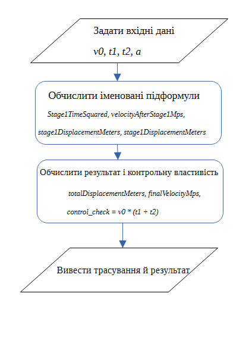
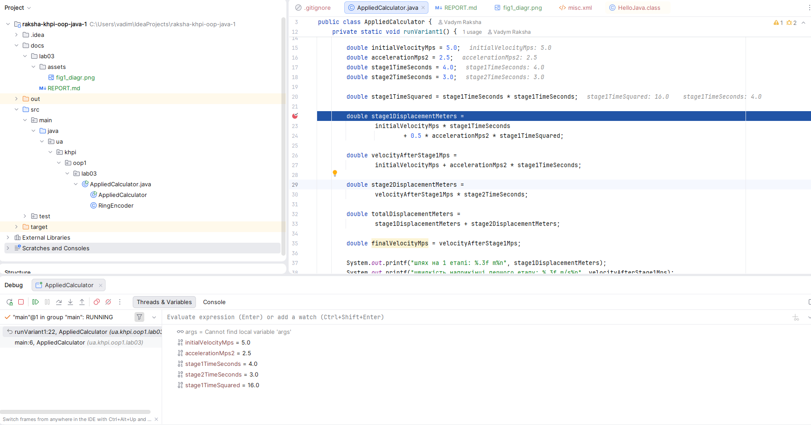

# Звіт з лабораторної роботи № 3

- **Тема:** Прикладні обчислення, вирази й оператори
- **Виконав:** Ракша Вадим КН-925А
- **Варіант:** 1
- **Репозиторій:** [URL репозиторію raksha-khpi-oop-java-1](https://github.com/Nevalik/raksha-khpi-oop-java-1)
- **Гілка:** `lab03`
- **Pull Request:**
## Мета

Метою роботи є точний переклад прикладної формули у вирази Java з
обґрунтованими типами проміжних результатів, явним порядком операцій,
розмірнісною перевіркою та відтворюваним набором тестових даних.

## Варіант (опис завдання)

**Варіант 1. Двоетапний рух.**

Обчислити кінцеву швидкість і сумарне переміщення після рівноприскореного
руху протягом часу `t1` та рівномірного руху протягом часу `t2`. Перевірити
граничні випадки `t1 = 0`, `t2 = 0` та `a = 0`.


**Задача 1: Кільцевий енкодер**

## Аналіз задачі

### Формули, одиниці та обмеження

Рух складається з двох послідовних етапів:

1. Рівноприскорений рух протягом `t1` з початковою швидкістю `v0` і
   прискоренням `a`:
    - `v1 = v0 + a*t1` - швидкість наприкінці етапу 1;
    - `s1 = v0*t1 + a*t1²/2` - переміщення за етап 1.
2. Рівномірний рух протягом `t2` зі швидкістю `v1` (яка не змінюється,
   оскільки прискорення на цьому етапі відсутнє):
    - `s2 = v1*t2` - переміщення за етап 2.

Підсумкові величини:

- `sTotal = s1 + s2` - повне переміщення;
- `vFinal = v1` - кінцева швидкість (дорівнює швидкості наприкінці етапу 1,
  оскільки на етапі 2 вона не змінюється).

Одиниці: `v0`, `v1`, `vFinal` - м/с; `a` - м/с²; `t1`, `t2` - с; `s1`, `s2`,
`sTotal` - м. Обмежень на знак `a` немає

### Дерево основного виразу

Дерево для `sTotal = (v0*t1 + a*t1²/2) + (v0 + a*t1)*t2`:

```
                          +
             ┌────────────┴────────────┐
             +                          *
      ┌──────┴──────┐            ┌──────┴──────┐
      *              *           +              t2
   ┌──┴──┐      ┌────┴────┐   ┌──┴──┐
   v0    t1     0.5       *   v0    *
              ┌───┴───┐   │        ┌─┴──┐
              a      t1²  a        a    t1
```

Ліва гілка (`s1`) обчислюється незалежно від правої (`s2`), права гілка
використовує вже обчислене значення `v1` як множник.

### Таблиця проміжних значень

| Величина | Java-тип | Одиниця | Вираз | Контроль |
|---|---|---|---|---|
| `initialVelocityMps` | double | м/с | вхід | - |
| `accelerationMps2` | double | м/с² | вхід | - |
| `stage1TimeSeconds` | double | с | вхід | - |
| `stage2TimeSeconds` | double | с | вхід | - |
| `stage1TimeSquared` | double | с² | `stage1TimeSeconds * stage1TimeSeconds` | ≥ 0 |
| `stage1DisplacementMeters` | double | м | `v0*t1 + 0.5*a*t1²` | - |
| `velocityAfterStage1Mps` | double | м/с | `v0 + a*t1` | - |
| `stage2DisplacementMeters` | double | м | `velocityAfterStage1Mps * t2` | - |
| `totalDisplacementMeters` | double | м | `stage1DisplacementMeters + stage2DisplacementMeters` | - |
| `finalVelocityMps` | double | м/с | `= velocityAfterStage1Mps` | - |

### Блок-схема




## Структура класів

Уся реалізація міститься в пакеті `ua.khpi.oop1.lab03`:

- `AppliedCalculator` - точка входу (`main`), методи `runVariant1()` та
  `runTask1RingEncoder()`;
- `RingEncoder` - package-private клас з алгоритмом кільцевого енкодера
  (задача 1), методи `clockwiseSteps` і `counterclockwiseSteps`.

## Алгоритми та опис програми

### Пріоритет, типи та порядок обчислення

Усі величини - `double`, тому проблеми цілочисельного ділення тут не виникає. Порядок обчислення відповідає дереву виразу:
спочатку `stage1TimeSquared`, потім `stage1DisplacementMeters` і
`velocityAfterStage1Mps` , потім
`stage2DisplacementMeters`, і  сума `totalDisplacementMeters`
Явні дужки використано в `0.5 * accelerationMps2 * stage1TimeSquared`, щоб
явно показати межу підформули, хоча пріоритет `*` тут і так лівоасоціативний.

### Компіляція і запуск

```powershell
git switch main
git pull --ff-only
git switch -c lab03
New-Item -ItemType Directory -Force out | Out-Null
javac -d out src\main\java\ua\khpi\oop1\lab03\AppliedCalculator.java
java -cp out ua.khpi.oop1.lab03.AppliedCalculator
```

## Тестування і визначення набору даних

### Ручний розрахунок

Типовий набір: `v0 = 5 м/с`, `a = 2.5 м/с²`, `t1 = 4 с`, `t2 = 3 с`

| Крок | Вираз | Значення | Розмірнісна перевірка |
|---|---|---|---|
| 1 | `t1²` | 16 | с² |
| 2 | `v0*t1` | 20 | м/с * с = м |
| 3 | `0.5*a*t1²` | 20 | м/с² * с² = м |
| 4 | `s1 = 20 + 20` | 40 | м |
| 5 | `v1 = 5 + 2.5*4` | 15 | м/с |
| 6 | `s2 = 15*3` | 45 | м |
| 7 | `sTotal = 40 + 45` | 85 | м |
| 8 | `vFinal = v1` | 15 | м/с |

### Набір даних

| Набір | Побудова | Вхідні дані | Очікуваний результат |
|---|---|---|---|
| Типовий | середина діапазону | v0=5, a=2.5, t1=4, t2=3 | sTotal=85 м, vFinal=15 м/с |
| Нульовий (t1=0) | межа | v0=5, a=2.5, t1=0, t2=3 | s1=0, sTotal=15 м, vFinal=5 м/с |
| Нульовий (a=0) | межа | v0=5, a=0, t1=4, t2=3 | sTotal=35 м (=v0*(t1+t2)), vFinal=5 м/с |
| Спеціальний (t1=t2) | симетрія | v0=0, a=2, t1=5, t2=5 | s1=25 м, v1=10 м/с, s2=50 м, sTotal=75 м |

### Властивість для незалежної перевірки

Якщо `a = 0`, модель зводиться до рівномірного руху на всій дистанції, тобто
`sTotal` має дорівнювати `v0*(t1 + t2)`. У коді ця перевірка реалізована
окремим виразом `uniformCheck`, що не використовує жодної з проміжних
змінних основного розрахунку - це незалежний спосіб перевірки коректності
формули.

### Ручне тестування операторів

**Пріоритет:**
```java
double first = a + b * c;
double second = (a + b) * c;
```
Для `a=2, b=3, c=4`: `first = 2 + 12 = 14`, `second = (2+3)*4 = 20` - різні
дерева, різний результат.

**Ліва асоціативність:**
```java
int leftAssociated = 20 / 5 * 2;      // (20/5)*2 = 8
int groupedDifferently = 20 / (5 * 2); // 20/10 = 2
```

**Префіксний і постфіксний інкремент:**
```java
int value = 4;
int postfix = value++; // postfix = 4, value стає 5
int prefix = ++value;  // value стає 6, prefix = 6
```

**Коротке замикання:**
```java
String text = null;
boolean safe = text != null && !text.isBlank(); // права частина НЕ обчислюється, safe = false
```

**Конкатенація:**
```java
System.out.println(2 + 3 + " units");   // "5 units" (спершу арифметика)
System.out.println("units: " + 2 + 3);  // "units: 23" (зліва направо, конкатенація)
System.out.println("units: " + (2 + 3)); // "units: 5" (дужки змінюють порядок)
```

### Налагодження



## Алгоритмічна задача

### Задача 1: Кільцевий енкодер

**Вхідні дані:** `from`, `to` - цілі числа в діапазоні `[0, 4095]`.
**Результат:** кількість кроків за годинниковою стрілкою (`clockwise`) і
проти неї (`counterclockwise`), обидва в діапазоні `[0, 4095]`.
**Обмеження:** енкодер має рівно 4096 положень (0…4095), номери зростають
за годинниковою стрілкою; за межами діапазону вхідні дані вважаються
некоректними і не оброблюються.

**Ідея алгоритму (псевдокод):**
```
rawDifference = to - from
clockwise = ((rawDifference mod 4096) + 4096) mod 4096
counterclockwise = (4096 - clockwise) mod 4096
```
Подвійне взяття `mod` потрібне тому, що оператор `%` у Java зберігає знак
лівого операнда, тож для від'ємної різниці результат `%` буде від'ємним;
додавання `4096` і повторний `%` приводять результат у коректний діапазон
`[0, 4095]`. Фінальний `% 4096` для `counterclockwise` захищає від значення
`4096` у випадку `from == to`.

**Реалізація:** клас `RingEncoder` (`clockwiseSteps`, `counterclockwiseSteps`),
опис - див. розділ «Структура класів».

**Таблиця очікуваних і фактичних результатів:**

| № | from | to | Очікувано (clockwise) | Фактично | Очікувано (counterclockwise) | Фактично | Статус |
|---|---|---|---|---|---|---|---|
| 1 | 100 | 140 | 40 | 40 | 4056 | 4056 | ОК |
| 2 | 4090 | 6 | 12 | 12 | 4084 | 4084 | ОК |
| 3 | 6 | 4090 | 4084 | 4084 | 12 | 12 | ОК |
| 4 | 512 | 512 | 0 | 0 | 0 | 0 | ОК |

**Незалежна перевірка (інваріант):** для будь-якої пари, де `from ≠ to`,
`clockwiseSteps(from, to) + counterclockwiseSteps(from, to) == 4096`. Для
`from == to` обидва значення дорівнюють `0`. Ця властивість перевірена для
всіх чотирьох наборів даних і виконується.

**Висновок по задачі:** алгоритм коректно обробляє звичайні пари, а також
граничний випадок переходу через нуль (`4090 → 6`) і випадок збігу позицій
(`512 → 512`); усі результати відповідають очікуваним значенням з умови
завдання.

## Висновки

У роботі реалізовано модель двоетапного руху (варіант 1) та алгоритм
кільцевого енкодера (задача 1) мовою Java. Формула розкладена на іменовані
проміжні величини з обґрунтованими типами й одиницями, порядок обчислення
перевірено вручну та за допомогою відлагодження, реалізовано незалежну
контрольну властивість для обох частин роботи. Усі передбачені набори даних
(типовий, граничні, спеціальний) дали очікувані результати.