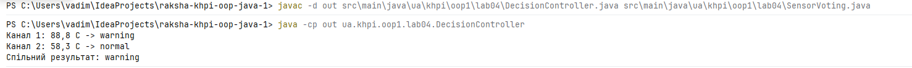
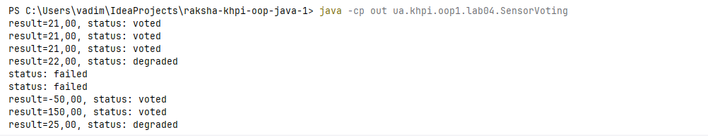
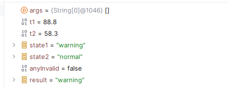
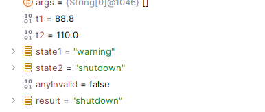

# Звіт з лабораторної роботи № 4

- **Тема:** Розгалужені алгоритми
- **Виконав:** Ракша Вадим, група КН-925А
- **Варіант:** 17 (система 1 - Двоканальний температурний контролер; задача 1 — Голосування трьох датчиків)
- **Репозиторій:** [<URL репозиторію raksha-khpi-oop-java-1>](https://github.com/Nevalik/raksha-khpi-oop-java-1)
- **Гілка:** `lab04`
- **Pull Request:** 

## Мета

Спроєктувати та реалізувати розгалужений алгоритм Java за формальною специфікацією: таблицею рішень, інтервалами, блок-схемою та граничними тестами.

## Варіант (опис завдання)

**Основний варіант (система 1, Двоканальний температурний контролер).** Два незалежні канали вимірюють температуру. Межі й пороги - ті самі, що в розібраному прикладі методички: технічний діапазон [-50, 150], пороги 20, 80, 110 (cold / normal / warning / shutdown). Некоректність хоча б одного каналу дає `invalid`; інакше спільний результат обирається за пріоритетом `shutdown > warning > cold > normal`.

**Алгоритмічна задача 1 (Голосування трьох датчиків).** Три незалежні датчики вимірюють одну температуру, допустимий діапазон [-50, 150]. За трьома коректними показами результат - медіана; при одному некоректному показі результат - середнє двох інших зі статусом `degraded`; при двох або трьох некоректних - статус `failed`.

## Аналіз задачі

### Вхідні дані, межі та категорії

| Категорія | Умова | Пріоритет | Результат |
|---|---|---|---|
| Некоректні дані | T1 або T2 не числові чи поза [-50,150] | 1 | invalid |
| Shutdown | будь-який канал ≥ 110 | 2 | shutdown |
| Warning | жоден не shutdown, будь-який канал у [80,110) | 3 | warning |
| Cold | жоден не shutdown/warning, будь-який канал у [-50,20) | 4 | cold |
| Normal | решта (обидва канали в [20,80)) | 5 | normal |

### Таблиця рішень

| Умова або дія | R1 | R2 | R3 | R4 | R5 |
|---|---|---|---|---|---|
| Дані T1, T2 числово коректні | ні | так | так | так | так |
| Хоча б один канал ≥ 110 | - | так | ні | ні | ні |
| Хоча б один канал у [80,110), жоден ≥110 | - | - | так | ні | ні |
| Хоча б один канал у [-50,20), жоден ≥80 | - | - | - | так | ні |
| **Категорія** | invalid | shutdown | warning | cold | normal |

### Блок-схема

```
початок
  │
  ▼
T1 і T2 числово коректні? ──ні──▶ invalid
  │так
  ▼
будь-який канал ≥110? ──так──▶ shutdown
  │ні
  ▼
будь-який канал у [80,110)? ──так──▶ warning
  │ні
  ▼
будь-який канал у [-50,20)? ──так──▶ cold
  │ні
  ▼
normal
```


### Граничні набори даних

| T1 | T2 | Стан1 | Стан2 | Результат | Пояснення |
|---|---|---|---|---|---|
| NaN | 50 | invalid | normal | invalid | Один канал некоректний |
| -50.0 | -50.0 | cold | cold | cold | Нижня технічна межа включена |
| 19.9 | 20.0 | cold | normal | cold | Пріоритет cold над normal |
| 79.9 | 80.0 | normal | warning | warning | Пріоритет warning над normal |
| 109.9 | 110.0 | warning | shutdown | shutdown | Найвищий пріоритет |
| 150.0 | 150.0 | shutdown | shutdown | shutdown | Верхня технічна межа включена |
| 150.1 | 0 | invalid | cold | invalid | Праворуч від верхньої межі |

## Структура класів

| Шлях | Призначення |
|---|---|
| `src/ua/khpi/oop1/lab04/DecisionController.java` | Реалізація основного варіанта (двоканальний контролер) |
| `src/ua/khpi/oop1/lab04/SensorVoting.java` | Реалізація алгоритмічної задачі 1 (голосування трьох датчиків) |
| `docs/lab04/report.md` | Цей звіт |

## Алгоритми та опис програми

### Порядок умов

`DecisionController`: кожен канал класифікується окремо ланцюжком `if-else if` (invalid → cold → normal → warning → shutdown, за зростанням порога). Спільний результат обирається порівнянням пріоритетів (менше число = вищий пріоритет), а не прямим порівнянням значень станів.

`SensorVoting`: спочатку рахується кількість валідних датчиків (`validCount`), потім за її значенням (3 / 2 / ≤1) вибирається одна з трьох гілок: медіана, середнє двох, або відмова.

### Використання if і switch

`if-else if` - для класифікації каналу за інтервалами (неперервна шкала). `switch` - лише для дискретного ключа: перетворення рядка стану на числовий пріоритет (`priority(String state)`).

### Компіляція і запуск

```powershell
javac -d out src\main\java\ua\khpi\oop1\lab04\DecisionController.java src\main\java\ua\khpi\oop1\lab04\SensorVoting.java
java -cp out ua.khpi.oop1.lab04.DecisionController
java -cp out ua.khpi.oop1.lab04.SensorVoting
```

## Тестування і визначення набору даних

### Результати всіх гілок

**DecisionController** (t1=86.5, t2=45.0):
```
Канал 1: 88.8 C -> warning
Канал 2: 58.3 C -> normal
Спiльний результат: warning
```


**SensorVoting** (усі 9 тестових наборів):
```
s1=20.0 s2=23.0 s3=21.0 -> result=21.00, status: voted
s1=23.0 s2=20.0 s3=21.0 -> result=21.00, status: voted
s1=21.0 s2=20.0 s3=23.0 -> result=21.00, status: voted
s1=NaN  s2=20.0 s3=24.0 -> result=22.00, status: degraded
s1=NaN  s2=NaN  s3=20.0 -> status: failed
s1=200.0 s2=NaN s3=20.0 -> status: failed
s1=-50.0 s2=-50.0 s3=-50.0 -> result=-50.00, status: voted
s1=150.0 s2=150.0 s3=150.0 -> result=150.00, status: voted
s1=-50.1 s2=20.0 s3=30.0 -> result=25.00, status: degraded
```



Медіана незалежна від порядку аргументів - усі три перестановки (20, 23, 21) дали 21

### Ручне тестування умов і переходів

| Перевірка | Очікуваний результат | Фактичний результат | Пояснення |
|---|---|---|---|
| Межа (T=20.0 замість 19.9) | normal замість cold | normal | `<` виключає межу з нижньої категорії - межа належить наступному інтервалу |
| Порядок порогів (тимчасово поміняти `< 20` і `< 80` місцями) | категорія cold стає недосяжною | cold ніколи не встановлюється | вужчу умову треба перевіряти раніше за ширшу |
| Коротке замикання (`isValid`: `Double.isFinite(t) && t >= -50.0`) | NaN не доходить до порівняння з межами | немає винятку | `isFinite` відсікає NaN/Infinity до порівнянь |
| Fall-through у switch (прибрати `->` у `priority`, лишити `case "shutdown": 0;` без break) | виконались би зайві гілки | не застосовується - стрілкова форма fall-through не має | стрілкова форма `switch` (`->`) переходу в наступну гілку не допускає |

### Налагодження

Breakpoint встановлено перед першим `if` у `classifyChannel`. Для типового набору (t1=88.8) Step Over показав послідовність: перевірка `isFinite` → `t<20.0` (false) → `t<80.0` (false) → `t<110.0` (true) → `return "warning"`. Для граничного значення t=110.0 трасування показало: усі три `<`-перевірки дали false, виконано `else { return "shutdown"; }` - підтверджує, що межа 110 включена в shutdown, а не в warning.





## Висновки

Реалізовано двоканальний температурний контролер (основний варіант) та алгоритм голосування трьох датчиків із медіаною без сортування (задача 1). Обидва алгоритми покривають усі граничні значення інтервалів, коректно обробляють некоректні (NaN, поза діапазоном) вхідні дані та дають однозначний результат для кожної допустимої комбінації входів. Порядок умов у ланцюжку `if-else if` підтверджено критичним: зміна порядку порогів робить окремі категорії недосяжними, що перевірено окремим тестом. Використання `switch`-виразу зі стрілковою формою виключило можливість fall-through-помилки при визначенні пріоритету стану.
 